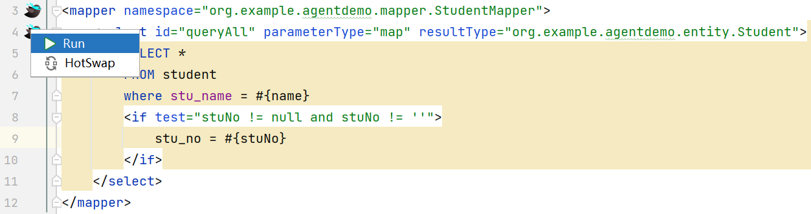
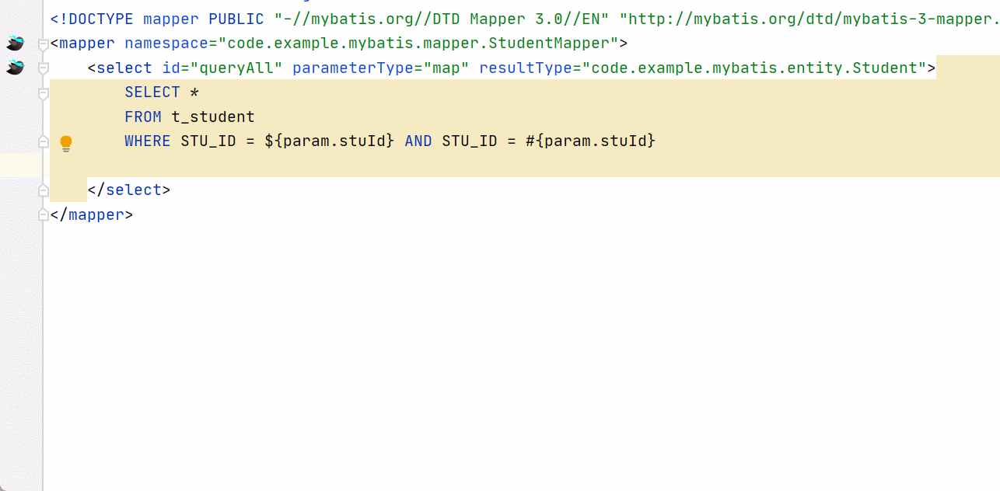

# MyBatisX-extension

This is a plugin based on Intellij Idea platform, forked
from <a href="https://github.com/baomidou/MybatisX" title="MyBatisX">MyBatisX</a> repository, aimed at assisting the
development process.

# Requirements

- Java 11+
- IntelliJ IDEA 2023.1.2 (Ultimate Edition)
- Gradle 8.4+

# Features

## MyBatis Sql Debugger

Right-Click on the Gutter Icon on every mybatis mapper statements.

Fill your params, and then you can get an executable sql without running you application.

## MyBatis Mapper XML Fragments

generate som common-used MyBatis Mapper XML Fragments sql template content like belows:

# Respect

1. Mybatisx
2. Sql Params Setter：https://plugins.jetbrains.com/plugin/14608-sql-params-setter
3. SuperHotSwap: https://github.com/songbiaoself/SuperHotSwap

